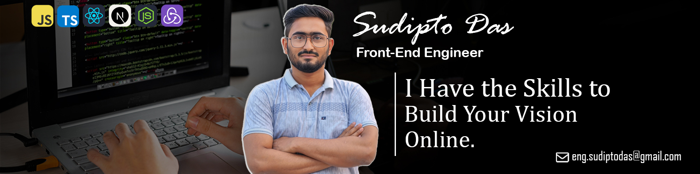

# Hi there! I am Sudipto Das.

**Lead Front-End Engineer | React, Next.js, JS & TS | Bridging UI/UX Architecture with Scalable Styling (Sass & Tailwind CSS)**

### About Me:
As a Lead Front-End Engineer with over 3 years of hands-on experience in web development, I act as the bridge between UI/UX architecture and scalable front-end logic. I specialize in building complex dashboards, interactive and high-performing SaaS interfaces, and scalable e-commerce platforms.

### What I Build:
Throughout my career, I have focused on architecting and developing large-scale web applications. With my core expertise in State, Logic, Real-time Data Visualization, API Integration, Design & UI/UX, I can build a high-traffic E-commerce platform, scalable SaaS products or a Travel Booking or Weather App. Whether I am building complex front-end structures or making sure a design looks perfect across different products, my goal is always to provide the best possible experience for the user.
 
 

### Other:

 

### Why My Tech Stack?
I choose the modern JavaScript ecosystem like React, Next.js, JS, and TypeScript because it offers the perfect balance of performance, maintainability, and future-proofing.
- **React & Next.js:** Allow me to build reusable component-based applications which is fast, highly interactive, SEO & user-friendly.
- **TypeScript:** It helps me write cleaner code with fewer bugs, making the application more stable and easier to update in the future.
- **Sass TailwindCSS & Bootstrap:** With Sass and Tailwind, I build beautiful designs quickly. They keep the code organized and light, making the website load faster and ensuring a seamless, high-performance user experience.
 
 

**🔭 I’m currently working on...**  
Architecting a micro-frontend and design system that ensures product consistency while increasing overall development efficiency by 40%.

**🌱 I’m currently learning...**  
Learning backend development to become a full-stack developer.

**📫 How to reach me...**  
Connect with me on [LinkedIn](https://www.linkedin.com/in/eng-sudipto/) for professional inquiries or reach out via [Email](mailto:eng.sudiptodas@gmail.com) for any tech collaborations.
 
 

